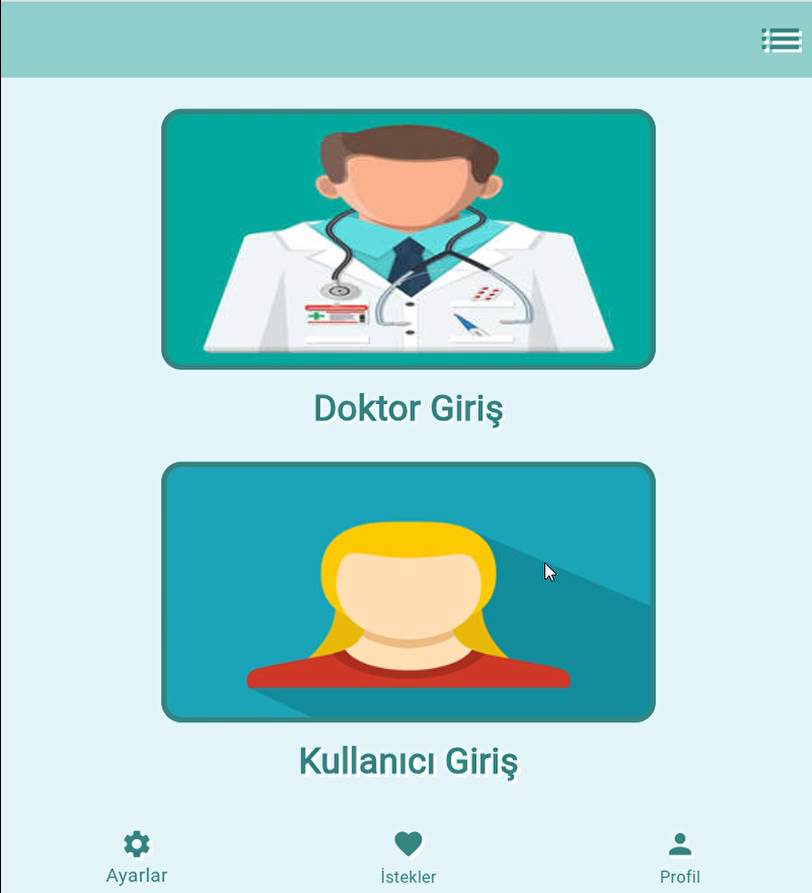
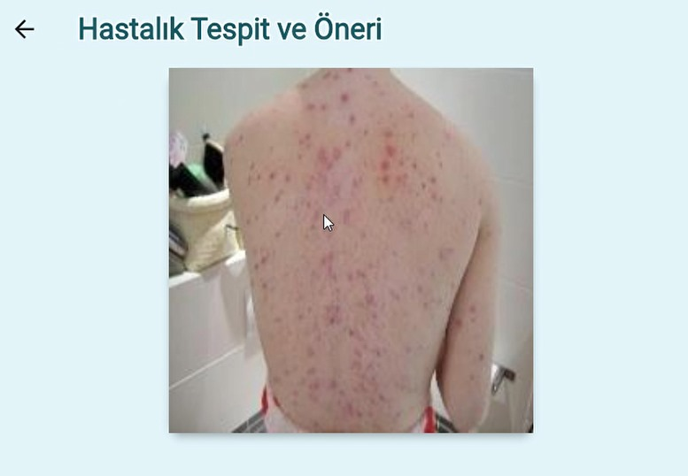
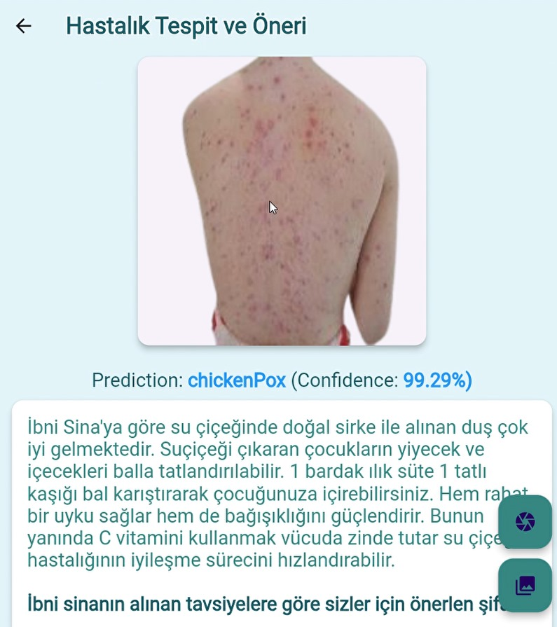
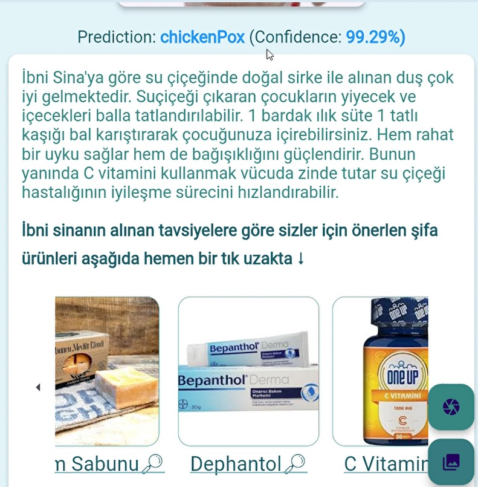

# Dermatology Support and Information Mobile Application

This project aims to develop a mobile application where users can get information about skin diseases and facilitate the diagnostic process of dermatologists. The project consists of two main parts:

1. **Dermatology Diagnostic Support System**: To help dermatologists diagnose skin diseases more accurately.
2. **User Information and Product Recommendation System**: Providing users with information about skin diseases and making appropriate product recommendations.

## Screenshots

<div style="display: flex; justify-content: center; gap: 20px;">
  
  
  
  
</div>


## Project Structure

- `deritespit_flutter/`: Flutter mobile app codes.
- `deripython_api/`: Python API codes.


## Installation

### Flutter App

1. Install Flutter SDK: [Flutter Install](https://flutter.dev/docs/get-started/install)
2. `flutter_app` dizinine gidin:
    ```sh
    cd flutter_app
    ```                           
3. Install the required packages:
    ```sh
    flutter pub get
    ```
4. Run the application:
    ```sh
    flutter run
    ```

### Python API

1. Install Python and pip. Install the Flutter SDK:
2. `python_api` dizinine gidin:
    ```sh
    cd python_api
    ```
3. Install required dependencies:
    ```sh
    pip install -r requirements.txt
    ```
4. Run the API:
    ```sh
    python app.py
    ```

## Usage

When the application is opened, the user can take a photo or upload an existing photo to identify skin diseases. The uploaded photo is displayed on the remove.bg website with an API link to remove.bg, which removes the noise in the background of the background image and thus aims to detect the skin disease with maximum accuracy. The user also receives detailed information about the predicted disease and can view the recommended products for the detected disease and access the products via a link.
